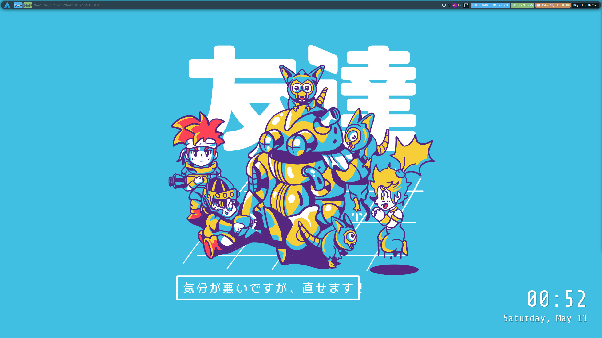

# Dotfiles Repository

Welcome to my dotfiles repository! Here, you'll find my personal collection of configuration files (dotfiles) for various tools and software I use. These dotfiles are designed to help streamline my development environment and maintain consistency across different machines.

Before you begin, ensure you have the following installed:
- Git
- Qtile
- Picom
- Fish
